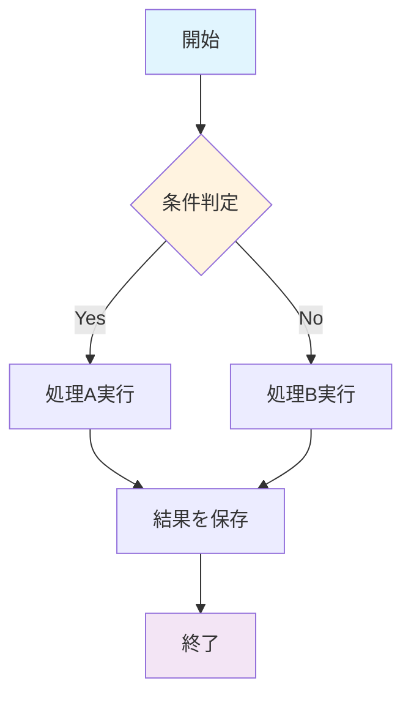
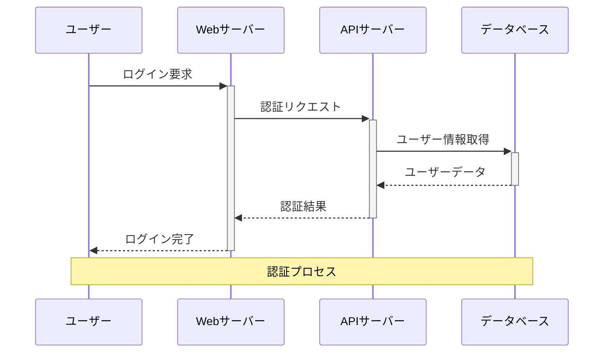
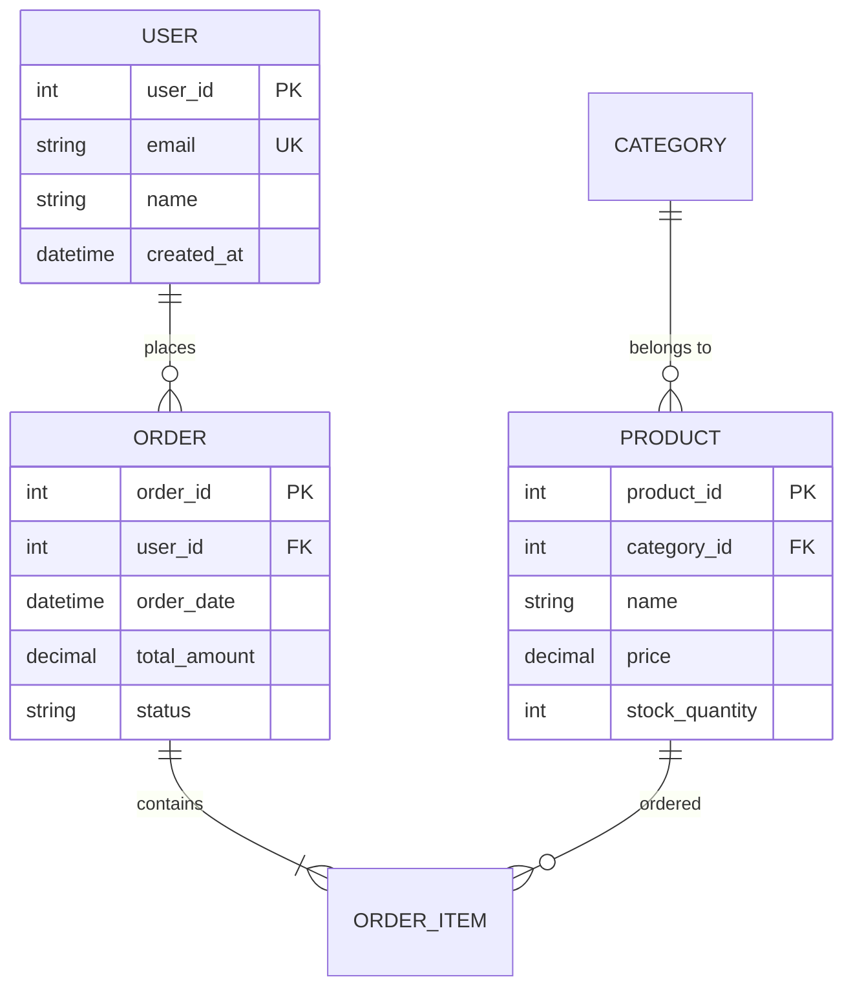
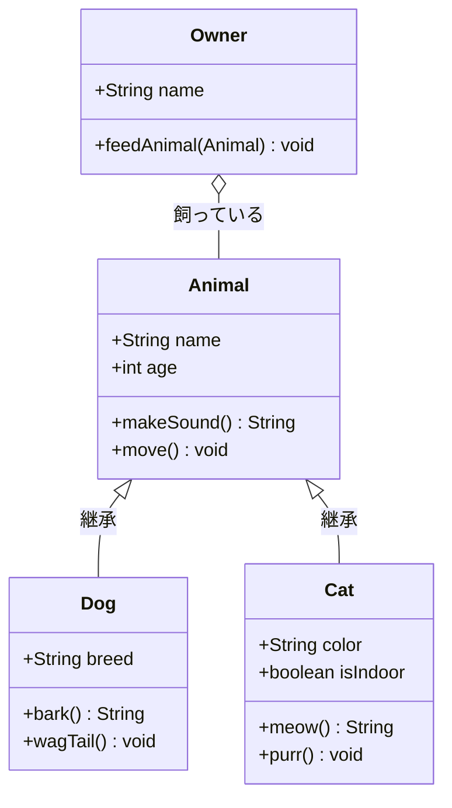
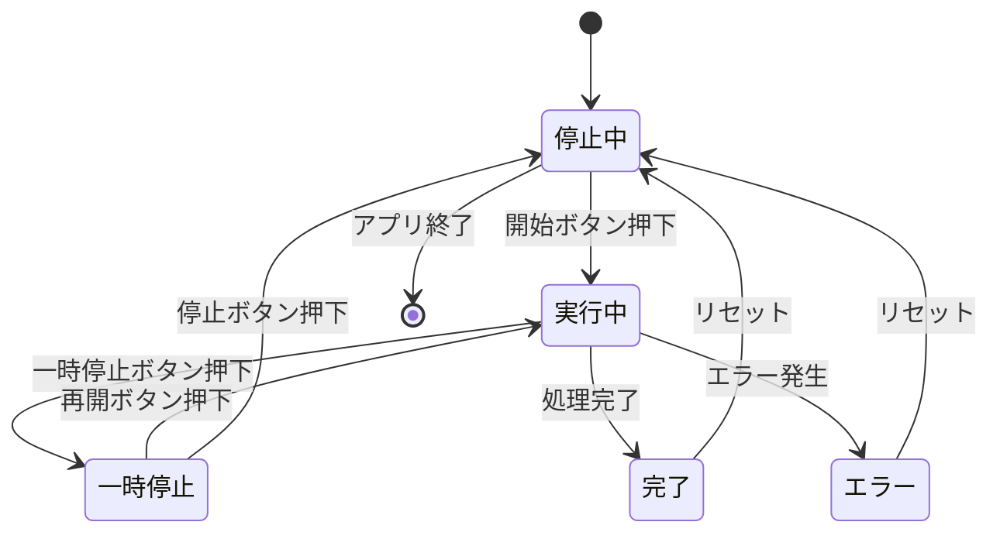
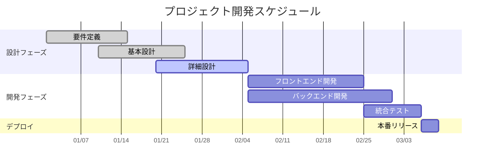
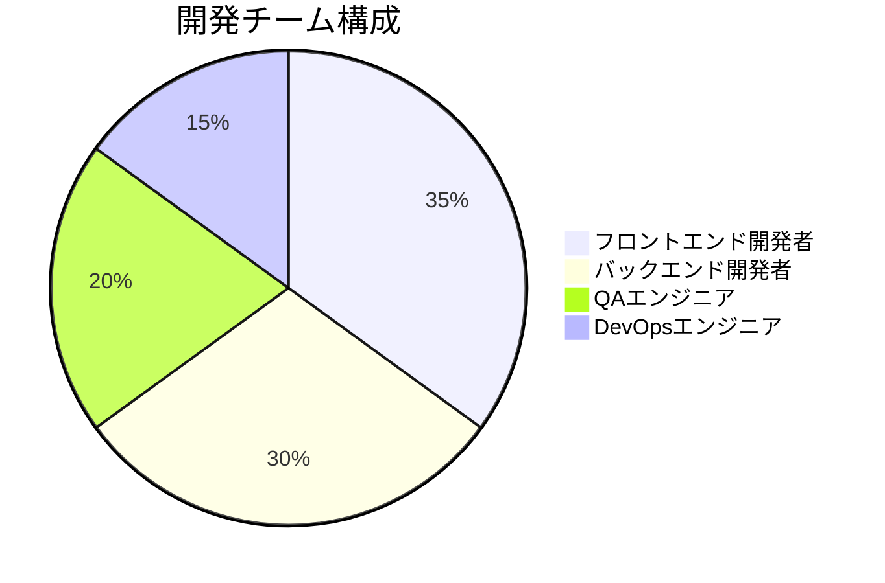
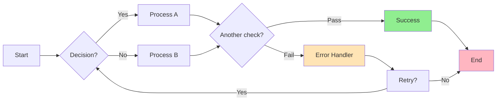

# Mermaid図表サンプル

このページでは、様々なMermaid図表タイプのサンプルを紹介します。これらの図表は、通常のビルドではSVG形式で表示され、PDF生成時（`ENABLE_PDF_EXPORT=1`）にPNG形式に変換されます。

## フローチャート

基本的なプロセスフローを表現します：

## シーケンス図

システム間の相互作用を時系列で表現します：

## ER図

データベース設計のエンティティ関係を表現します：

## クラス図

オブジェクト指向設計のクラス関係を表現します：

## 状態図

システムやオブジェクトの状態遷移を表現します：

## ガントチャート

プロジェクトスケジュールとタスクの進行を表現します：

## パイチャート

データの割合や構成比を表現します：

## フローチャート（条件分岐付き）

より複雑なフローチャートを表現します：

---

これらの図表はすべて、Mermaidの記法で作成され、プラグインによって適切な形式（SVGまたはPNG）で表示されます。PDF生成時には自動的にPNG形式に変換されるため、文書の配布や印刷に適した形式で出力されます。
