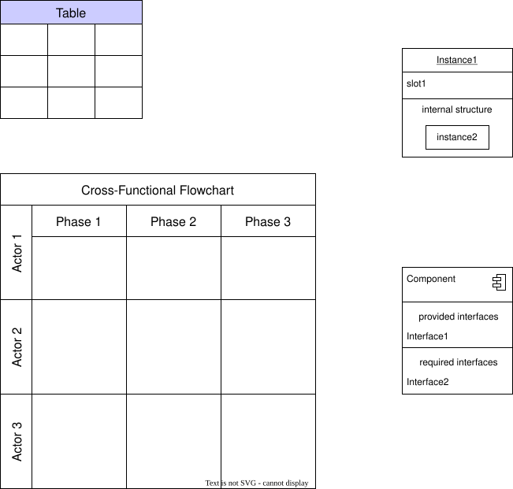

# SVG Examples

Sample SVG files in a nested structure.

This page introduces various usage examples of SVG code blocks and SVG file references.

## SVG Code Blocks

### Basic Circle

<svg width="120" height="120" xmlns="http://www.w3.org/2000/svg">
  <circle cx="60" cy="60" r="50" stroke="#333" stroke-width="2" fill="#4CAF50" />
  <text x="60" y="65" text-anchor="middle" fill="white" font-family="Arial" font-size="14">Circle</text>
</svg>

### Rectangle with Gradient

<svg width="200" height="100" xmlns="http://www.w3.org/2000/svg">
  <defs>
    <linearGradient id="grad1" x1="0%" y1="0%" x2="100%" y2="0%">
      <stop offset="0%" style="stop-color:#FF6B6B;stop-opacity:1" />
      <stop offset="100%" style="stop-color:#4ECDC4;stop-opacity:1" />
    </linearGradient>
  </defs>
  <rect x="10" y="10" width="180" height="80" fill="url(#grad1)" rx="10" ry="10"/>
  <text x="100" y="55" text-anchor="middle" fill="white" font-family="Arial" font-size="16" font-weight="bold">
    Gradient Rectangle
  </text>
</svg>

### Shapes with Path Element

<svg width="150" height="150" xmlns="http://www.w3.org/2000/svg">
  <path d="M75,10 L90,40 L120,40 L98,60 L105,90 L75,75 L45,90 L52,60 L30,40 L60,40 Z"
        fill="#FFD700" stroke="#FFA500" stroke-width="2"/>
  <text x="75" y="120" text-anchor="middle" font-family="Arial" font-size="12" fill="#666">Star Shape</text>
</svg>

## SVG File References

### Detailed Diagram Created with Draw.io

For complex diagrams, use SVG files:

### Color Variations

